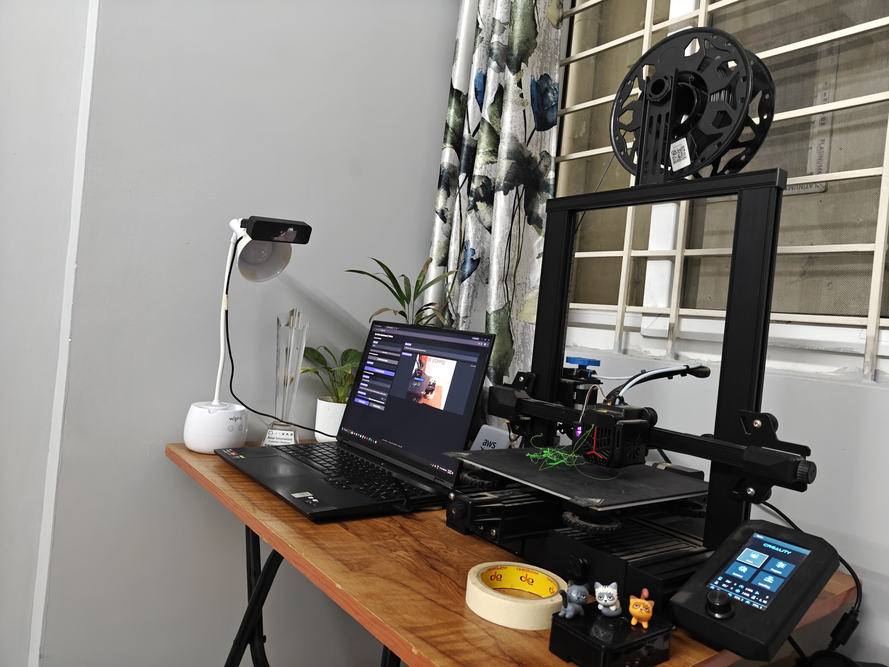
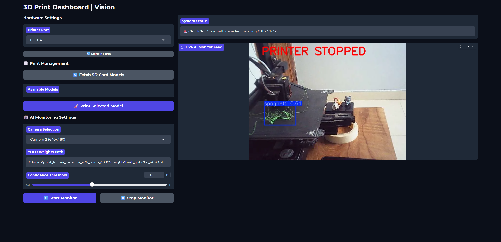

# 🖨️ 3D Printing & Makerspace

Welcome to my central repository for all things related to 3D printing. This repo houses my 3D models, G-codes, datasets, and my custom AI-based print failure detection system built for the Creality Ender-3 V2 Neo. 


## 📂 Repository Contents

- **`Models/`**: My collection of 3D models and generated G-code files.
- **`src/` & `utils/`**: Source code for my real-time YOLO-based **Print Failure Detection System**.
---

## 🛑 Print Failure Detection System

One of the core projects in this repository is a real-time 3D print failure detection system using AI (YOLO). Point a webcam at your printer, and the system continuously watches for common FDM printing defects and can automatically pause or kill the print before things get worse.



*Built for the Creality Ender-3 V2 Neo, but works with any FDM printer + webcam setup.*

### What It Detects

| Defect | Description | Severity |
|--------|-------------|----------|
| 🍝 **Spaghetti** | Print detaches from bed and extrudes into a tangled mess | 🔴 Critical — auto-stops printer |
| 🧵 **Stringing** | Thin filament wisps between travel moves | 🟡 Cosmetic — logs alert |
| 🔵 **Zits** | Small blobs/bumps on the print surface | 🟢 Minor — logs alert |

### 🎛️ 3D Print AI Dashboard (New!)



I've built an integrated web dashboard (`src/print-dashboard.py`) using Gradio that combines printer control and AI monitoring into a single interface:

- **Smart Hardware Detection**: Automatically tests COM ports to find the active 3D printer and selects the best available webcam.
- **SD Card Management & Printing**: Fetch G-code files from the printer's SD card and start prints remotely via USB.
- **Live AI Monitoring**: Streams the webcam feed with real-time YOLOv8 annotations directly to your browser.
- **Native Auto-Stop**: Safely shares the active serial connection to trigger an `M112` Emergency Stop if critical failures (spaghetti) are detected.

**How to run the dashboard:**
```bash
pip install -r requirements.txt
python src/print-dashboard.py
```
*Access the UI at `http://127.0.0.1:7860`*

## 📝 Read the Blog Series

I documented the entire process of building the failure monitoring system in a series of blog posts. Check them out for a deep dive into the development, training, and deployment:

- [Building a 3D Print Failure Detection System](https://www.orbital.net.in/blog/ender-3-v2-neo-print-failure-detection)
- [Monitoring and Auto-Stopping Failed Prints](https://www.orbital.net.in/blog/ender-3-v2-neo-print-failure-detection-monitoring)
- [All 3D Printing Posts](https://www.orbital.net.in/blog?category=3D%20Printing)
